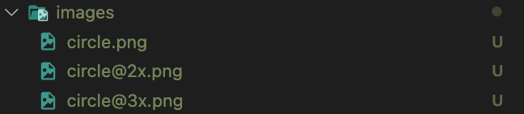

> 본 예제는 Typescrip template로 작성됨.

<br/>

<br/>

### 실행 방법

`yarn ios` 또는 `yarn android`

> 안드로이드는 안드로이드 에뮬레이터를 켠 상태로 위 명령어 실행

<br/>
<br/>

# 3장, 할일 목록 만들기(Todo List)

## 새로 알게된 것

- `<StatusBar/>`는 OS에 따라 사용할 수 있는 기능이 나뉜다.

  - 대표적으로 배경색 지정, currentHeight 구하는 속성은 안드로이드만 가능하다.
  - [StatusBar 관련 공식 문서](https://reactnative.dev/docs/0.68/statusbar)

  ```jsx
  // ios만 StatusBar에 지정한 blue 색상이 적용되지 않는다
  const StatusBarText = () => {
    return (
      <View style={{flex: 1}}>
        <StatusBar backgroundColor={'blue'} />
        <View style={{flex: 1, backgroundColor: 'red'}}></View>
      </ㅍ>
    );
  };
  ```

  

  <br/>

- `react-native-safe-area-context` 라이브러리 사용하였는데 유용함
  <br/>
- 이미지는 기종에 따라 가장 최적화된 이미지로 보여준다.

  - 아래 이미지들이 있고 이미지를 연동하는 코드에는 `circle.png`를 연결해도 기종에 따라 가장 선명한 해상도의 이미지를 보여준다(화면에서는 circle@3x.png)

  

  ```jsx
  <Image source={require('../assets/images/circle.png')} />
  ```

  <!--  -->
  

  <br/>

## 새롭게 느껴지는 것

- 기본적으로 display 가 flex 이고 flexDirection이 column으로 잡혀있어서 순차적 UI 전개가 가능하며
  굳이 컴포넌트마다 flex를 쓰지 않아도 제일 넓은 비중을 차지해야하는 컴포넌트에 flex를 지정하면 잔여 공간을 모두 차지함 (대신 상위 컴포넌트에 flex 지정해줘야함 )

## 느낀 점
