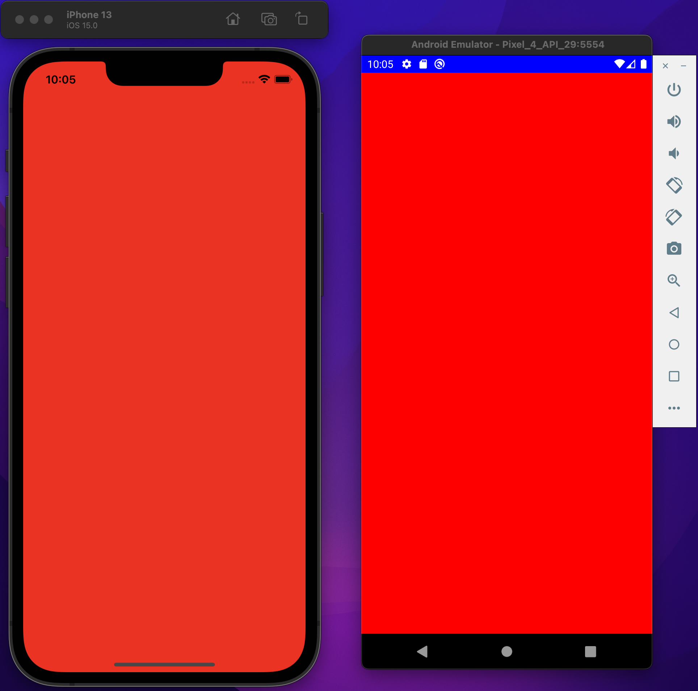
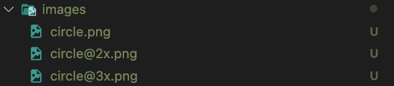
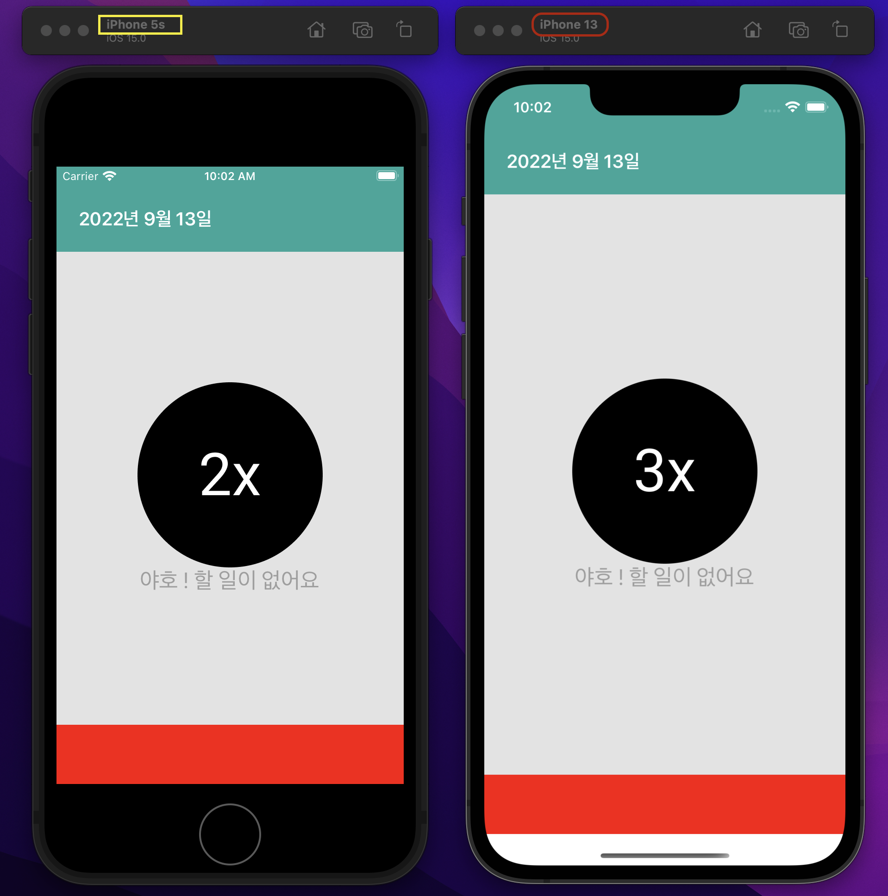
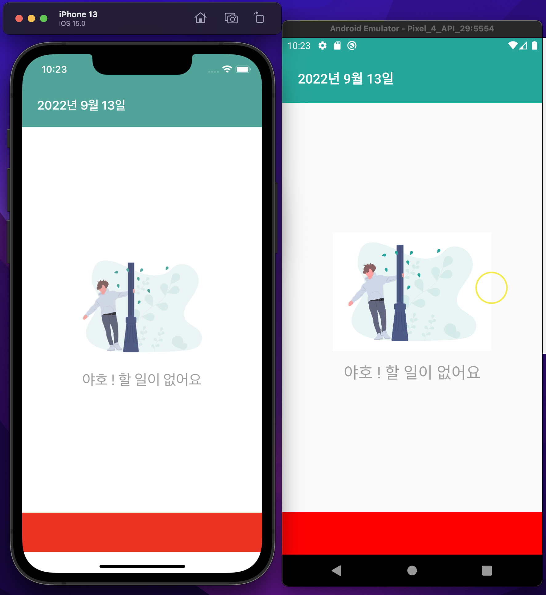
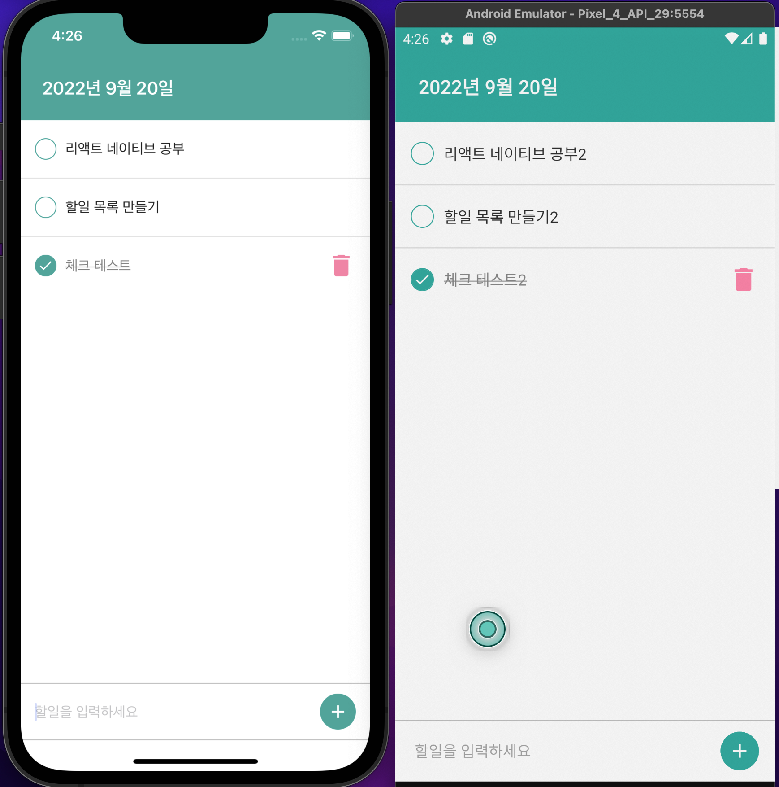

> 본 예제는 Typescrip template로 작성됨.

<br/>

<br/>

### 실행 방법

`yarn ios` 또는 `yarn android`

> 안드로이드는 안드로이드 에뮬레이터를 켠 상태로 위 명령어 실행

<br/>
<br/>

# 3장 ~ 4장, 할일 목록 만들기(Todo List)

## 새로 알게된 것

- `<StatusBar/>`는 OS에 따라 사용할 수 있는 기능이 나뉜다.

  - 대표적으로 배경색 지정, currentHeight 구하는 속성은 안드로이드만 가능하다.
  - [StatusBar 관련 공식 문서](https://reactnative.dev/docs/0.68/statusbar)

  ```jsx
  // ios만 StatusBar에 지정한 blue 색상이 적용되지 않는다
  const StatusBarText = () => {
    return (
      <View style={{flex: 1}}>
        <StatusBar backgroundColor={'blue'} />
        <View style={{flex: 1, backgroundColor: 'red'}}></View>
      </ㅍ>
    );
  };
  ```

  

  <br/>

- `react-native-safe-area-context` 라이브러리 사용하였는데 유용함
  <br/>
- 이미지는 디바이스 화면 밀도 따라 가장 선명한 이미지로 보여준다

  - 아래 이미지들이 있고 이미지를 연동하는 코드에는 `circle.png`를 연결해도 기종에 따라 가장 선명한 해상도의 이미지를 보여준다(화면에서는 circle@3x.png)

  

  ```jsx
  <Image source={require('../assets/images/circle.png')} />
  ```

  

  <br/>

- Resize Mode

  - 별도의 이미지 Resize를 하지 않으면 200dp x 200dp 사이즈로 설정되며 보여진다
  - Resize Mode를 설정하지 않으면 `cover` 로 기본 설정된다

  <br/>

- Background Color 의 차이

  - 백그라운드 색상을 지정하지 않은 상태에서 ios는 흰색으로 표현되지만 android는 연한 회색으로 나타난다
    

  <br/>

- KeyboardAvoidingView 에서 behavior

  - padding : 키보드가 열렸을때 뷰 하단의 패딩을 설정
  - height : 뷰의 높이 자체를 변경 (키보드가 닫혔을때에도 적용됨)
  - position : 뷰의 위치 설정

- `Keyboard.dismiss();` 키보드 객체를 컨트롤하여 키보드를 닫을 수 있다.
- `<FlatList/>` 에서 `ItemSeparatorComponent` 속성은 리스트를 구성하는 아이템 컴포넌트의 gap에 대한 정의를 할 수 있다.
- react-native에 자체 내장되어 있던 `AsyncStorage` 는 커뮤니티에서 유지보수 하면서 라이브러리로 분리되었음
  - : @react-native-async-storage/async-storage
  - Promise 문법 또는 async/await 문법을 활용하여 사용

## 새롭게 느껴지는 것

- 기본적으로 display 가 flex 이고 flexDirection이 column으로 잡혀있어서 순차적 UI 전개가 가능하며
  굳이 컴포넌트마다 flex를 쓰지 않아도 제일 넓은 비중을 차지해야하는 컴포넌트에 flex를 지정하면 잔여 공간을 모두 차지함 (대신 상위 컴포넌트에 flex 지정해줘야함 )

- TextInput 태그에서 text에 관한 변경을 하려면 onChangeText

## 느낀 점

- Expo cli와 비교하였을 때 라이브러리 선택/적용에 있어서 네이티브 진영에 신경써야할 부분이 많아 어려운 것 같으면서도 편리한 것 같다
  
