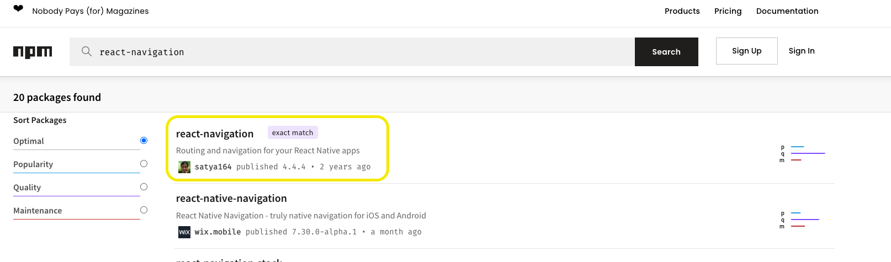

> 본 예제는 Typescript template 으로 작성되었고, 5장 예시의 내용은 JS로 구현되어있지만 TS로 적용하며 스터디 진행
> 그래서 다른 장(12장)에 타입스크립트 적용하기 내용과 중복될 수 있음

<br/>

<br/>

### 실행 방법

1. `yarn` 명령어를 통해 dependency 설치
2. `cd ios`로 이동후 `pod install` 설치
3. `yarn ios` 또는 `yarn android`

<br/>
<br/>

# 5장, 리액트 네비게이션 적용하여 여러 화면 관리하기

## 새로 알게된 것

- `react-navigation` 과 `react-native-navigation` 두 라이브러리가 있는데, 전자의 라이브러리 사용

  - `react-navigation` : 리액트 네이티브 커뮤니티에서 관리하며, 사용률 높음, 네비게이션 기능이 js로 구현되어 있음
  - `react-native-navigation` Wix에서 관리하며, 기존 네이티브 앱에 리액트 네이티브를 적용할 경우 적합함, 네비게이션기능이 네이티브로 구현되어 있음

  

  <br/>

- 컴포넌트 내부에서 navigation 속성을 사용하려면 `useNavigation` hook을 통해 사용하고 아래 코드와 같이 타입을 제네릭으로 지정

  ```typescript
  //1. 각 stack 별 파라미터 리스트를 작성
  export type RootStackParamList = {
    Home: undefined;
    Detail: {id: number};
  };

  //NativeStackNavigationProps 인터페이스 내 제네릭으로 스택별 파라미터리스트를 넣고 Record로 key 값을 받고 있으니 해당하는 key값 입력
  type ProfileScreenNavigationProp = NativeStackNavigationProp<
    RootStackParamList,
    'Detail'
  >;

  // 아래와 같이 선언하여 사용
  const navigate = useNavigation<ProfileScreenNavigationProp>();
  ```

- 컴포넌트 내부에서 route 속성도 마찬가지로 `useRoute` hook을 통해 사용하고 아래 코드와 같이 타입을 제네릭으로 지정

  ```typescript
  //1. 각 stack 별 파라미터 리스트를 RouteProp 인터페이스 내부에 입력하고 key값도 함께 입력
  const route = useRoute<RouteProp<RootStackParamList, 'Detail'>>();
  ```

  - 아래와 같이 컴포넌트 내부에서 route 객체 내부 params 값을 사용

  ```typescript
  import {View, Text, Button} from 'react-native';
  import React from 'react';
  import {NativeStackNavigationProp} from '@react-navigation/native-stack';
  import {RootStackParamList} from '../App';
  import {RouteProp, useNavigation, useRoute} from '@react-navigation/native';

  type ProfileScreenNavigationProp = NativeStackNavigationProp<
    RootStackParamList,
    'Detail'
  >;

  const DetailScreen = () => {
    const navigate = useNavigation<ProfileScreenNavigationProp>();
    const route = useRoute<RouteProp<RootStackParamList, 'Detail'>>();

    return (
      <View>
        <Text>DetailScreen</Text>
        <Text>id : {route.params.id}</Text>
        <Button title="뒤로가기 " onPress={() => navigate.goBack()} />
      </View>
    );
  };

  export default DetailScreen;
  ```

- navigate 와 push 의 차이점은 같은 화면일때에 스택이 쌓이는지 아닌지의 차이

  - 예시: Detail 페이지 일 경우 param값만 바꿔서 같은 Detail 페이지로 navigate 할 경우 스택이 쌓이지 않음

- `react-native-gesture-handler` 는 드로어 네비게이터 에서 사용자의 제스처를 인식하기 위해 내부적으로 사용하는 라이브러리
- `react-native-reanimated` 는 리액트 네이비트에 내장된 애니메이션 효과 기능보다 더욱 개선된 성능으로 애니메이션 효과를 구현해주는 라이브러리
  - `react-native-reanimated`적용을 위해서 `babel.config.js` 에 `plugins: ['react-native-reanimated/plugin']` 추가해야함
    ```javascript
    module.exports = {
      presets: ['module:metro-react-native-babel-preset'],
      plugins: ['react-native-reanimated/plugin'],
    };
    ```
  - 그리고 pod install 해주고 실행 전 `yarn start --reset-cache` 를 해주어 캐시 삭제 한 뒤 실행
  - 참고로 `react-native-reanimated@2.8.0`버전은 안드로이드 에러 이슈, `react-native-reanimated@next`는 `WARN Sending`onReanimatedPropsChange` with no listeners registered.`이슈가 있다.
- Drawer에 내에 StackNavigator를 쌓을 수 있다.

## 느낀 점
