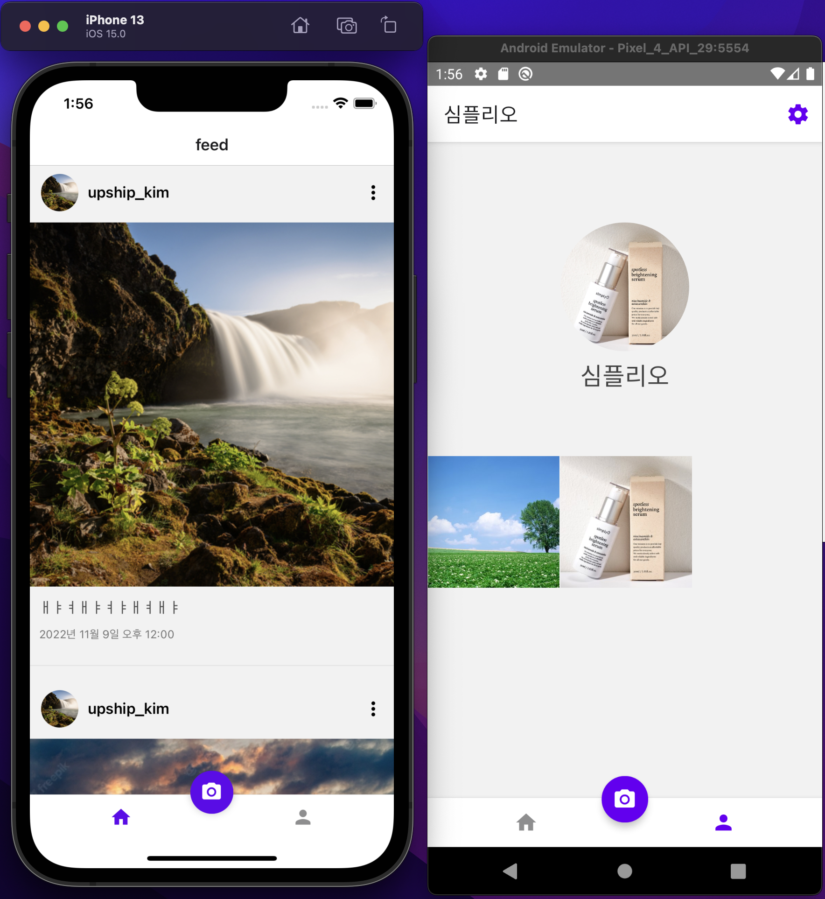

> 본 예제는 Typescript template 으로 작성되었고, 6~7장 예시의 내용은 JS로 구현되어있지만 TS로 적용하며 스터디 진행
> 그래서 다른 장(12장)에 타입스크립트 적용하기 내용과 중복될 수 있음

<br/>

<br/>

### 실행 방법

1. `yarn` 명령어를 통해 dependency 설치
2. `cd ios`로 이동후 `arch -x86_64 pod install` 설치
3. `arch -x86_64 pod install --repo-update` 설치
4. `yarn start` 이후 `yarn ios` 또는 `yarn android`

<br/>
<br/>

# 08~09 Firebase 로 사진 공유 앱 만들기

## Trouble Shooting

### 1. firebase 라이브러리 설치 이후 빌드 실패

```jsx
//버전 정보
{
  'react version' : "18.1.0"
  'react-native version' : "0.70.4"
  'react-native-firebase version' : "16.4.0"
  'Xcode version' : "13.4.1"
  'Xcode project format version' : "Xcode 12.0 compatible"
}
```

**1) 빌드 실패 현상**

- "리액트 네이티브를 다루는 기술" 책을 참고하여 Firebase 연동 챕터를 진행하였을 때 ios 빌드 실패와
  Firebase 연동을 위해 설치한 `react-native-firebase` 라이브러리 관련 에러가 매우 많이 발생함

- 책이 집필된 시점의 RN version 과 현재 시점의 버전이 맞지 않아 생긴 이슈라 생각했지만 근본적으로 이슈가 발생하였을때 **_공식 문서보다_** 스택오버플로우나 국내외 블로그를 참고했던게 시간을 더 많이 들였던 근본적인 원인이 되었다고 생각함

**2) 해결 방안**

- [react-native-firebase 공식 문서](https://rnfirebase.io/) 와 [react-native-firebase v6버전 마이그레이션 문서](https://rnfirebase.io/migrating-to-v6)를 주로 참고하였고
- 환경 셋팅에 있어 기본적인 내용은 '리액트 네이티브를 다루는 기술' 책을 참고하였다.
- 셋팅이 진행됨에 있어서 `#import <Firebase.h> 를 찾을 수 없다는 에러 로그` 를 맞닥뜨렸을 때는 [스택오버플로우 관련 글](https://stackoverflow.com/questions/63771070/use-of-undeclared-identifier-firapp) 을 참고하여 해결
- 빌드는 성공이 되었지만 시뮬레이터를 구동함에 있어서 크러쉬 난 이슈에 대해서는 [애플 공식 문서](https://developer.apple.com/documentation/xcode/understanding-the-exception-types-in-a-crash-report#EXCCRASH-SIGABRT) 를 통해 어떤 원인인지 파악하였고, [react-native-firebase 의 git issue](https://github.com/invertase/react-native-firebase/issues/247#issuecomment-315131432) 를 통해 해결할 수 있었다.

**3) reference**

- "리액트 네이티브를 다루는 기술" 책
- [react-native-firebase 공식 문서](https://rnfirebase.io/)
- [react-native-firebase v6버전 마이그레이션 문서](https://rnfirebase.io/migrating-to-v6)
- [스택오버플로우 관련 글](https://stackoverflow.com/questions/63771070/use-of-undeclared-identifier-firapp)
- [애플 공식 문서](https://developer.apple.com/documentation/xcode/understanding-the-exception-types-in-a-crash-report#EXCCRASH-SIGABRT)
- [react-native-firebase 의 git issue](https://github.com/invertase/react-native-firebase/issues/247#issuecomment-315131432)

### 2. useNavigation hook의 동적 활용

**목표**

- 하단 BottomTab 내에 `home` 과 `myProfile` 로 나누어 지는데 두 가지 탭에서 모두
  Profile 화면을 재사용한다.
- home에서는 나뿐 아니라 다른 유저의 프로필을 확인할 수 있어야하고,
- myProfile 에서는 나의 프로필을 확인할 수 있어야 한다.
- 하지만 두 탭에서 Profile 화면을 열때에 navigation Type을 다르게 지정하고 열어야 각각 탭에서 profile화면에 도달하였을 때 올바르게 해당 탭에 focusing이 된다.

**1) 해결방안**

- 처음 typescript의 `유틸리티 타입`을 활용하여 타입을 분기처리하려 하였다.
- `HomePostNavigateType` 과 `MyProfilePostNavigateType` 을 정의해두고 MainTab navigate의 RouteName 을 파악/분기처리하여 위 두 타입을 나누려 하였다.
- 하지만 유틸리티 타입은 제네릭 타입에 따라 동적으로 분기처리는 가능하지만 RouteName 디테일한 값에 따라 분기처리가 어려웠고, 코드를 생산할수록 가독성이 떨어졌다.
  (활용 Utility Types: Record, Extract, Pick, T extends boolean ? Home~ : MyProfile~ )

**2) 해결방안**

- useNavigation hook을 제공하는 `@react-navigation/native` 의 공식 문서를 확인하였고,
  타입스크립트에 대응하는 타입들이 무엇이 있는지 확인하였다.
- 그리고 [공식 문서](https://reactnavigation.org/docs/typescript/#organizing-types) 를 통해 `CompositeNavigationProp` 이란 타입의 역할을 확인하였고, 간결하게 사용할 수 있었다.
- Stack이 다른 두 navigate의 타입을 병합하여 간편하게 이동할 수 있는 타입을 제공한다.

### 완성 이미지

  
